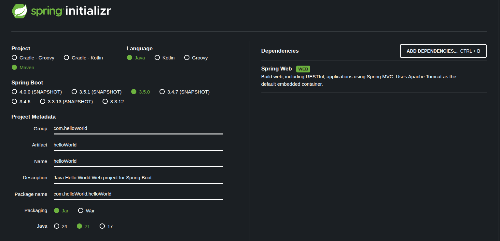

# Hello World

# Content
- [Hello World](#hello-world)
- [Content](#content)
- [Install](#install)

# Install

1. Install Spring Initializr



2. Add contoller layer

```java
package com.helloWorld.helloWorld.controller;

import org.springframework.web.bind.annotation.GetMapping;
import org.springframework.web.bind.annotation.RequestMapping;
import org.springframework.web.bind.annotation.RestController;

@RestController
@RequestMapping("/hello")
public class helloWorldApi {
	
	@GetMapping
	public String helloWorld() {
		return "Hello World";
	}

}

```

3. Send Get Request

URL: http://localhost:8080/hello