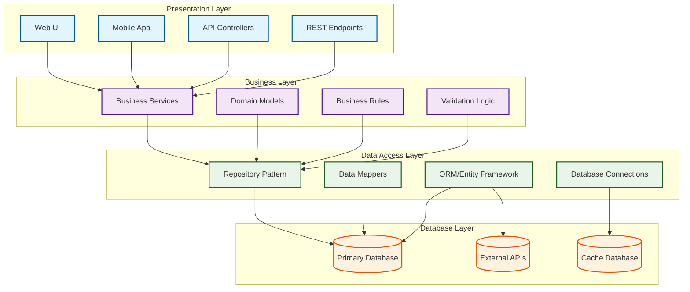

# Layered Arhcitecture

# Content
- [Layered Arhcitecture](#layered-arhcitecture)
- [Content](#content)
- [Layered](#layered)

# Layered

* Database:  Veritabanının tanımlanması
* Entities: Veritabanı nesnelerinin ve özelliklerinin tanımlandığı katman
* Data Access Layer: Veritabanı nesnelerine erişim için gerekli tanımlamaların yapıldığı katman
* Business: İş kurallarının tanımlandığı katman
* Core: Ortak kullanımların tanımlandığı katman
* Web Api: End-Point tanımlamlarının yapıldığı katman

