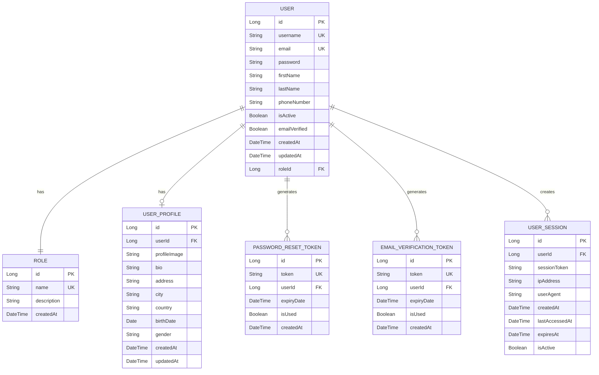

# User Panel

# Content
- [User Panel](#user-panel)
- [Content](#content)
- [Install](#install)
- [ER Diagram](#er-diagram)

# Install

Download Project from Spring Initializr

# ER Diagram

```mermaid
erDiagram
    USER {
        Long id PK
        String username UK
        String email UK
        String password
        String firstName
        String lastName
        String phoneNumber
        Boolean isActive
        Boolean emailVerified
        DateTime createdAt
        DateTime updatedAt
        Long roleId FK
    }
    
    ROLE {
        Long id PK
        String name UK
        String description
        DateTime createdAt
    }
    
    USER_PROFILE {
        Long id PK
        Long userId FK
        String profileImage
        String bio
        String address
        String city
        String country
        Date birthDate
        String gender
        DateTime createdAt
        DateTime updatedAt
    }
    
    PASSWORD_RESET_TOKEN {
        Long id PK
        String token UK
        Long userId FK
        DateTime expiryDate
        Boolean isUsed
        DateTime createdAt
    }
    
    EMAIL_VERIFICATION_TOKEN {
        Long id PK
        String token UK
        Long userId FK
        DateTime expiryDate
        Boolean isUsed
        DateTime createdAt
    }
    
    USER_SESSION {
        Long id PK
        Long userId FK
        String sessionToken
        String ipAddress
        String userAgent
        DateTime createdAt
        DateTime lastAccessedAt
        DateTime expiresAt
        Boolean isActive
    }

    USER ||--|| ROLE : "has"
    USER ||--o| USER_PROFILE : "has"
    USER ||--o{ PASSWORD_RESET_TOKEN : "generates"
    USER ||--o{ EMAIL_VERIFICATION_TOKEN : "generates"
    USER ||--o{ USER_SESSION : "creates"

```