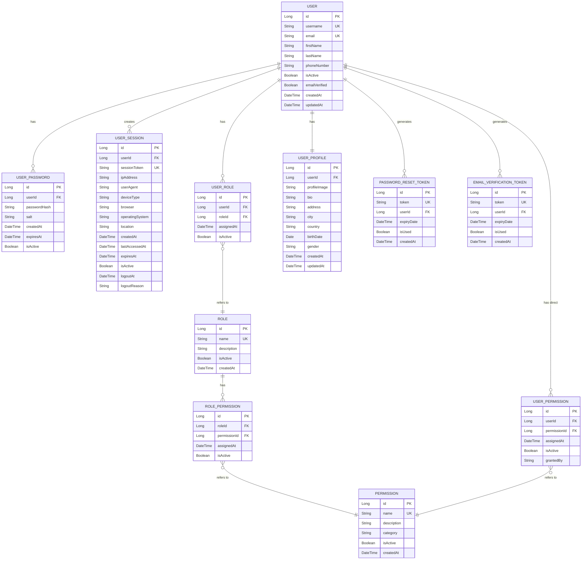

# User Panel

We will focus on basic User Panel functions.

# Content
- [User Panel](#user-panel)
- [Content](#content)
- [To-dos](#to-dos)
- [Requirement Gathering](#requirement-gathering)
- [Software Design](#software-design)
  - [Monolithic](#monolithic)
  - [Layered Architecture](#layered-architecture)
  - [ER Diagram](#er-diagram)
  - [Data Flow Diagram](#data-flow-diagram)
- [Install](#install)

# To-dos

*  [x] Temel isterlerin oluşturulması, gereksinimlerin netleştirilmesi
*  [x] Tasarım
   *  [x] Sistem Mimarisi
   *  [x] Veritabanı
*  [ ] Kodlama
   *  [ ] Geliştime Ortamı (Backend-Frontend)
   *  [ ] Kodlama Standartı
   *  [ ] Versiyon Kontrolü
*  [ ] Test
   *  [ ] Birim Testlerinin oluşturulması
*  [ ] Dağıtım
   *  [ ] Projenin canlıya alınması

# Requirement Gathering

Kullanıcıların sisteme güvenli bir şekilde kayıt olup giriş yapabileceği bir kullanıcı paneli oluşturmak. Kullanıcı sistem içerisinde kendine ait bilgileri görüntüleyebilme, bazı bilgilerini güncelleyebilme gibi özelliklere sahip olmalı. Gelişmiş özellikler ilerleyen süreçler içerisinde eklenecektir.

# Software Design

## Monolithic


## Layered Architecture

```
┌─────────────────────────────────────┐
│          Web API Layer              │ ← Controllers
├─────────────────────────────────────┤
│         Security Layer              │ ← JWT, Permissions
├─────────────────────────────────────┤
│        Business Layer               │ ← Services
├─────────────────────────────────────┤
│       Data Access Layer             │ ← Repositories
├─────────────────────────────────────┤
│         Entity Layer                │ ← JPA Entities
├─────────────────────────────────────┤
│          Core Layer                 │ ← Utilities, Results
└─────────────────────────────────────┘

```

## ER Diagram



## Data Flow Diagram


# Install

Download Project from Spring Initializr

